# TokTickIT Lab 2 — Final Evidence Index

This file indexes the evidence generated during Issue 8. The PNG files are produced from the real requester E2E flow with Playwright by running `CAPTURE_EVIDENCE=1`; they are not mockups.

## 1. Responsive / UI Evidence

All screenshots are under `artifacts/lab-02/screenshots/`.

| File | Evidence shown |
|---|---|
| `01-requester-selection-desktop.png` | S1 desktop: Zen Green shell, Development Requester dropdown, testing-only explanation, active-requester notice, Check System utility |
| `02-requester-selection-mobile-menu.png` | S1 mobile: hamburger menu and Check System access without horizontal overflow |
| `03-create-ticket-desktop.png` | S2 desktop: Category, Related System, Requested Priority, Summary, Description, attachment upload, action hierarchy |
| `04-create-ticket-tablet.png` | S2 tablet layout at 820 px |
| `05-create-ticket-mobile.png` | S2 mobile stacked layout at 390 px |
| `06-create-ticket-success.png` | Successful create state with generated Ticket Number |
| `07-my-tickets-desktop.png` | S3 desktop table with search, filters, sort, pagination, status and Requested Priority |
| `08-my-tickets-tablet.png` | S3 tablet table at 820 px |
| `09-my-tickets-mobile.png` | S3 mobile ticket card at 390 px |
| `10-ticket-detail-active-desktop.png` | S4 owned Ticket Detail with active attachment and Download/Remove actions |
| `11-ticket-detail-active-mobile.png` | S4 mobile Ticket Detail with no page-level horizontal overflow |
| `12-ticket-detail-removed-reason.png` | S4 after soft removal: retained attachment metadata, Removed state, recorded removal reason, no Download/Remove actions |
| `14-requester-isolation-no-results.png` | After requester switch, searching for the first requester's ticket returns No results |
| `15-my-tickets-empty-state.png` | My Tickets empty state with Create Ticket CTA |

These screenshots cover the Lab 2 Desktop (`>=992px`), Tablet (`768–991px`), and Mobile (`<768px`) presentation required by V-1/V-2/V-3.

### Screenshot previews

#### S1 — Development Requester Selection (Desktop)

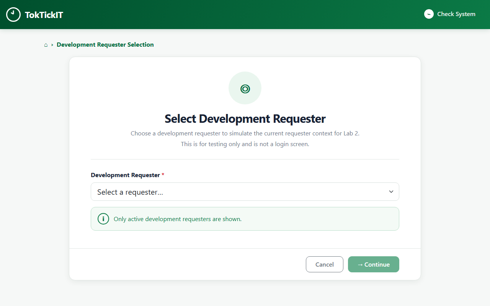

#### S1 — Development Requester Selection (Mobile menu)

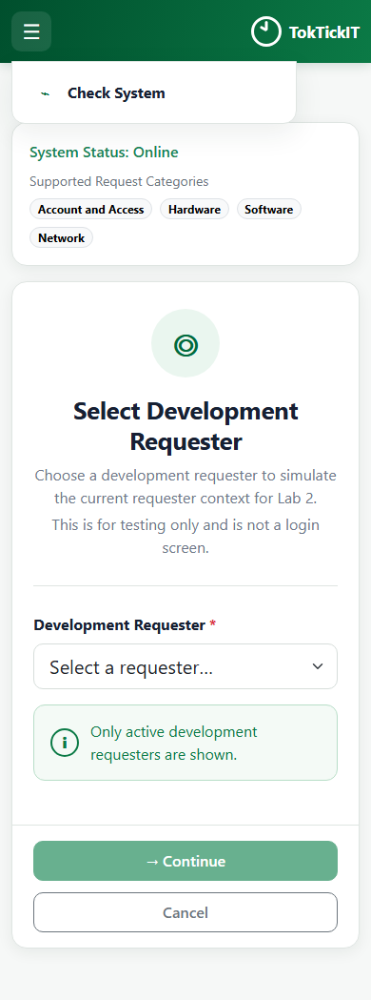

#### S2 — Create Ticket (Desktop)

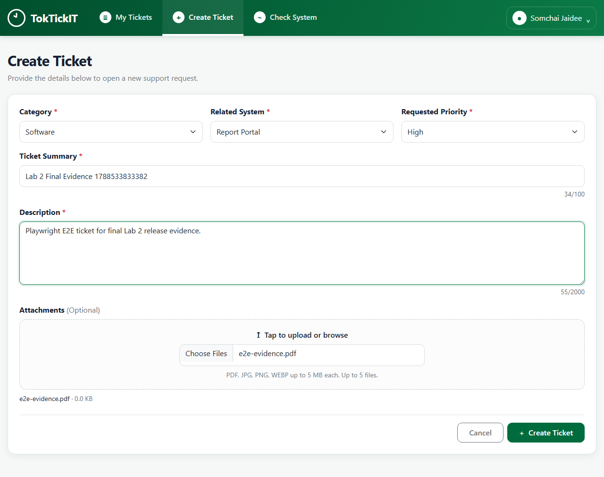

#### S2 — Create Ticket (Tablet)

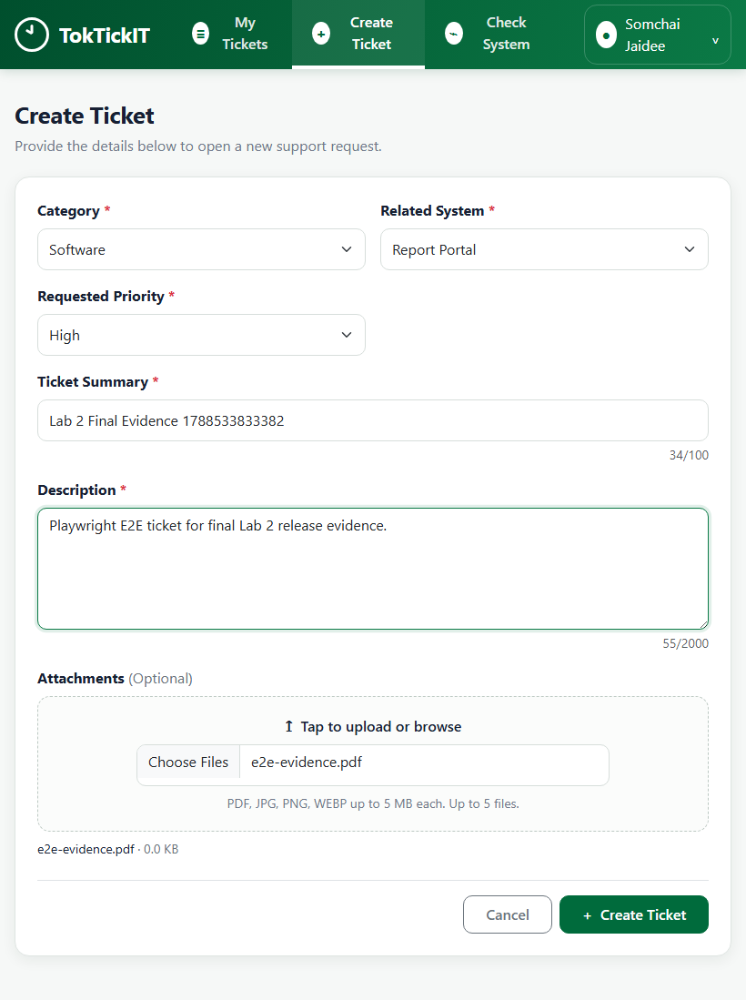

#### S2 — Create Ticket (Mobile)

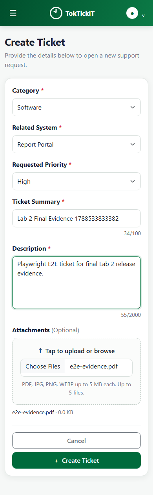

#### S2 — Create Ticket Success

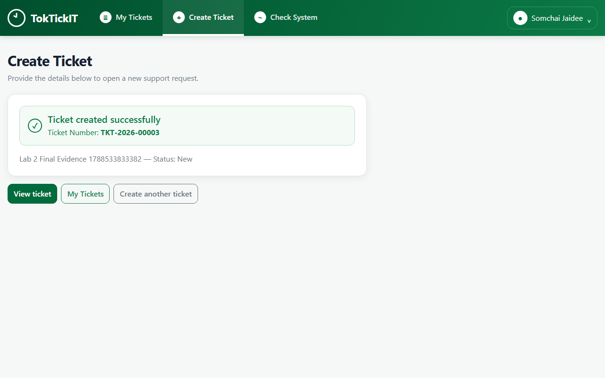

#### S3 — My Tickets (Desktop)

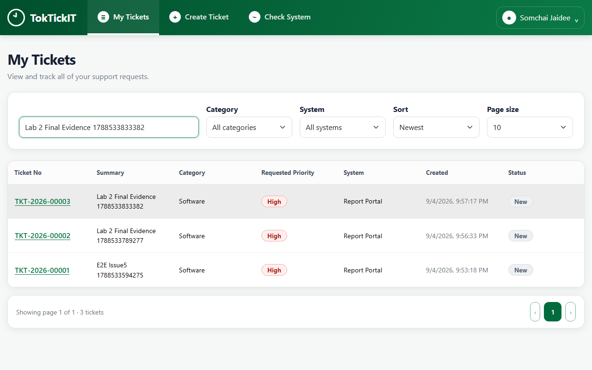

#### S3 — My Tickets (Tablet)

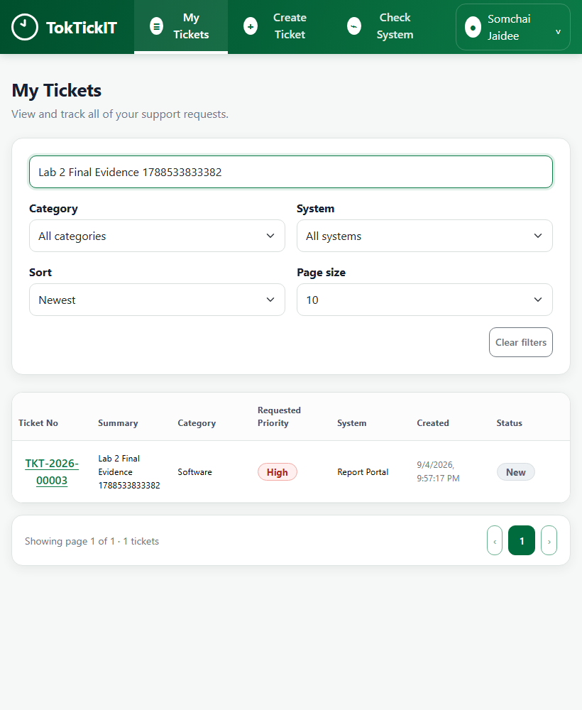

#### S3 — My Tickets (Mobile)

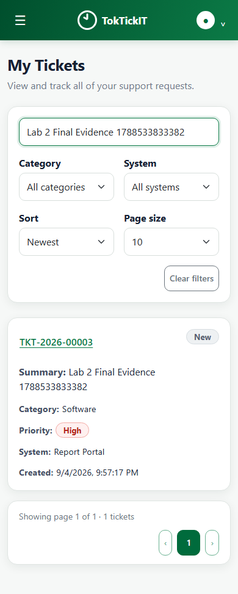

#### S4 — Ticket Detail with active attachment (Desktop)

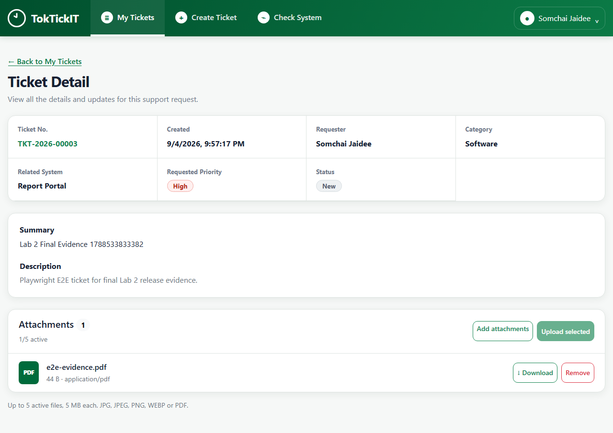

#### S4 — Ticket Detail with active attachment (Mobile)

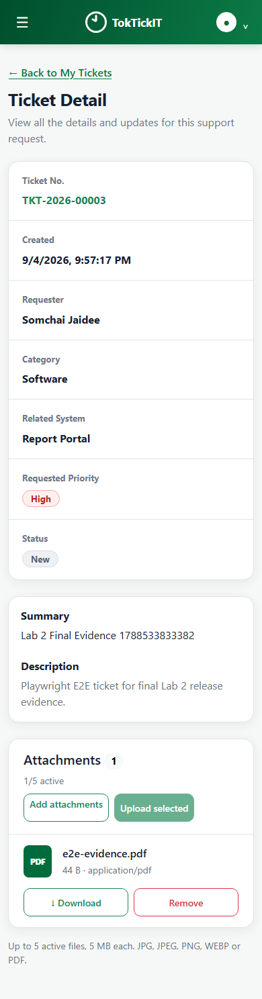

#### S4 — Removed attachment with removal reason

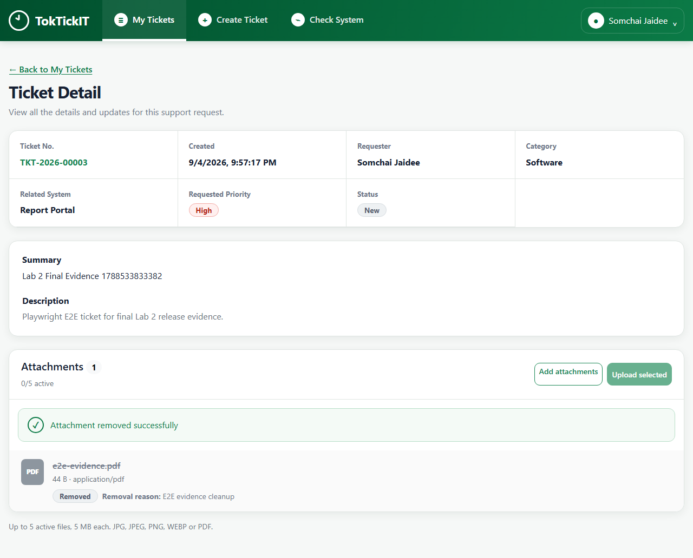

#### Requester isolation — No results for another requester

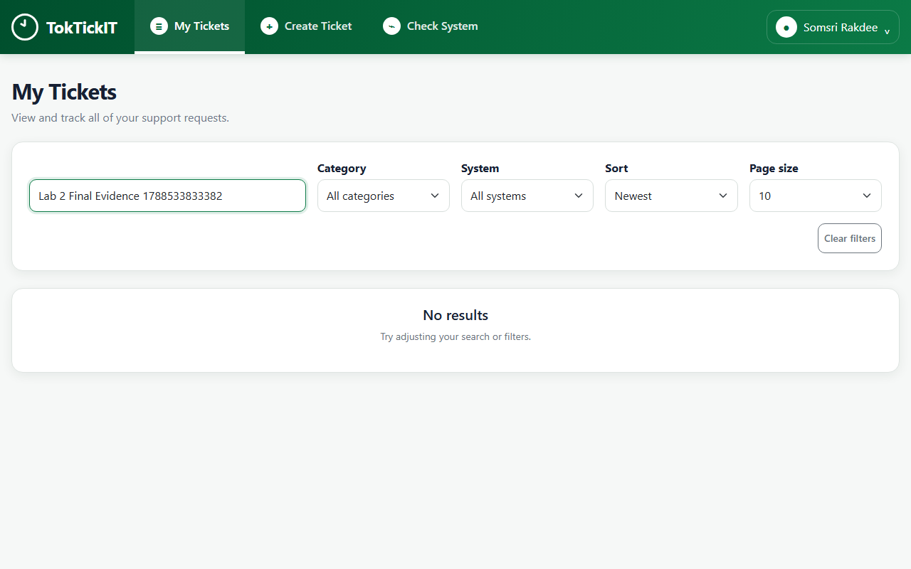

#### My Tickets — Empty state

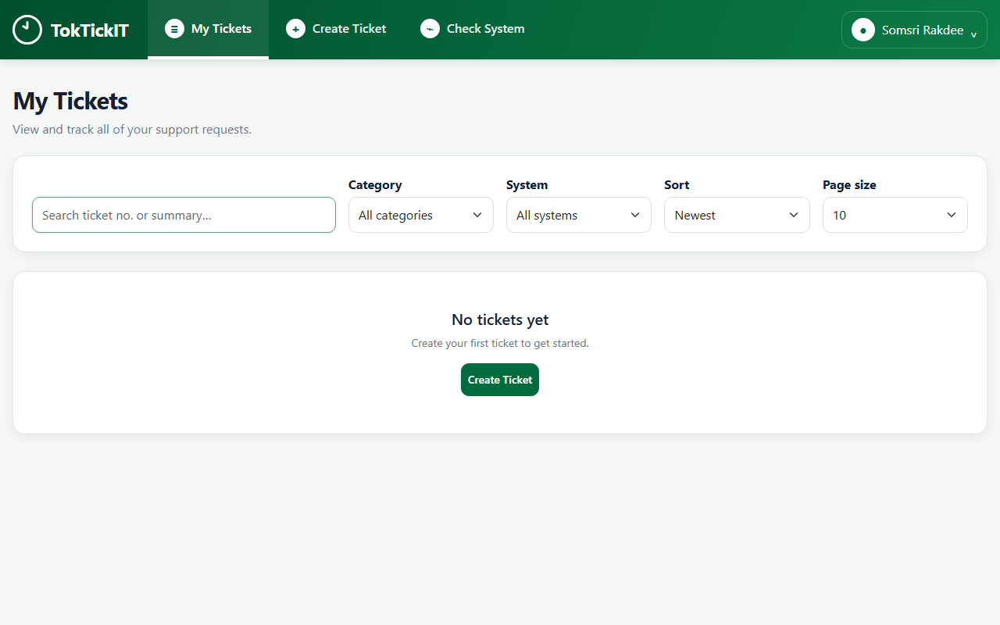

## 2. Part 8 Attachment / Ownership Evidence

The same Playwright flow proves the required attachment lifecycle and requester isolation:

1. Create an owned ticket with Requested Priority `High` and an attachment.
2. Open the owned Ticket Detail.
3. Download the active attachment and verify the suggested filename is the original filename.
4. Soft-remove the attachment after providing the reason `E2E evidence cleanup`.
5. Verify the removed row retains filename/size/type/reason metadata and has no Download/Remove actions.
6. Attempt direct download of the removed attachment and verify HTTP `409`.
7. Attempt to read the ticket as another active Development Requester and verify HTTP `404`.
8. Switch the browser requester and verify the first requester's ticket is absent from My Tickets.

Machine-readable evidence from that run is stored in:

`artifacts/lab-02/screenshots/13-api-ownership-removal-evidence.json`

Expected evidence values:

- `requestedPriority`: `High`
- `activeAttachmentDownloadSuggestedFilename`: `e2e-evidence.pdf`
- `removalReason`: `E2E evidence cleanup`
- `removedAttachmentDownloadStatus`: `409`
- `otherRequesterTicketDetailStatus`: `404`

## 3. Search / Filter / Sort / Pagination / States

- Search by Summary and Ticket Number is exercised end-to-end by E-2 and by A-7.
- Category filter plus `oldest` / `newest` sorting is covered by A-8.
- Pagination metadata (`page`, `pageSize`, `totalItems`, `totalPages`) is covered by A-9.
- Empty and no-results states are covered by UI-5 and screenshots `14-...` / `15-...`.
- Requester list loading/error behavior and Create Ticket validation/busy/error behavior are covered by the client UI regression suite.

## 4. Peer Review / CI Evidence

See `docs/lab-02/reviewer.md` for the detailed review history.

- PR #24 — Issue 4 — approved + merged
- PR #25 — Issue 5 — final exact-head review approved + merged
- PR #29 — Issue 6 — approved + merged
- PR #30 — Issue 7 — approved + merged
- Issue 8 PR — pending until the student approves commit/push/PR

## 5. Final Regression

The final Issue 8 regression is recorded in `docs/lab-02/tests.md`: server **49/49**, client **25/25**, server/client builds, Prisma validation, and Playwright **1/1** all passed. Release PR `lab2-staging` → `main` remains intentionally out of scope until Issue 8 is reviewed and merged.
